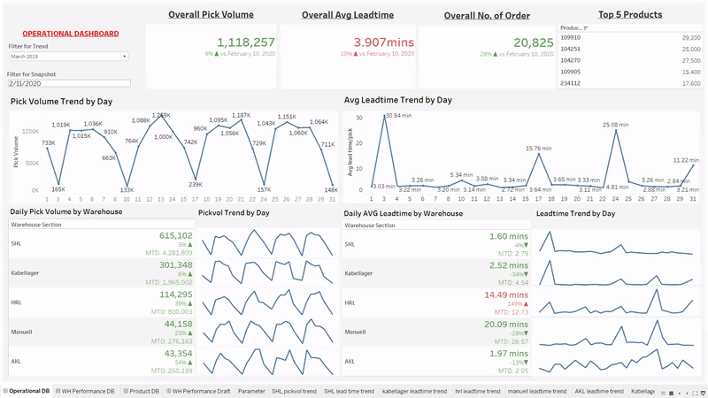
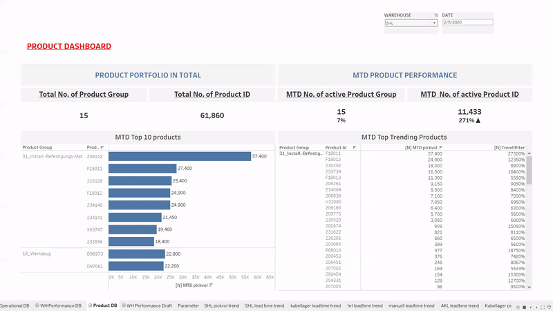

# Warehouse Perfomance Monitoring Dashboard

## Project Overview

This project comprises two main components:
1. ETL with Python
2. EDA and Dashboard Creation with Tableau

## ETL with Python

1. Business Understanding
Understand the business context of the data being analyzed.

2. Loading Data
Load the completed CSV file into Python for processing.

3. Lite EDA (Exploratory Data Analysis)
Conduct preliminary EDA to grasp data shape and types.

4. Build ER Model
Construct an Entity-Relationship (ER) model to establish relationships between tables, facilitating efficient merge operations for the dashboard.

5. Identify Data Inconsistencies
Detect and describe inconsistencies like missing values, duplicates, null values, negative values, and abnormalities.

6. Apply ETL Process
i. Transformation:
	- Data Cleansing: Address identified inconsistencies, removing and flagging data as necessary. Perform Univariate analysis post data cleansing.
	- Data Restructuring and Enrichment: Segment data into smaller tables based on the ER model. Aggregate data to optimize table length for improved dashboard performance. Enhance data tables by adding attributes for detailed KPI performance, such as speed per item per pick.

	ii. Load Data:
Populate the transformed data tables by connecting to SQL.

## EDA and Dashboard Creation with Tableau

1. Connect SQL with Tableau
Establish a connection between SQL and Tableau using an Extract connection for enhanced dashboard performance.

2. Calculate Warehouse KPIs
Utilize a time horizon approach to compute Warehouse Key Performance Indicators (KPIs), enabling historical trend analysis up to the most recent available time.

3. Structure Dashboard
Organize the dashboard into three main sections:

1. Operational Dashboard: Provides an overview snapshot of overall Warehouse performance.
   
2. Analytic Dashboard 1 & 2: Facilitates insight drill-down for the top two critical metrics.
   - Warehouse Performance Dashboard
     
   - Product Analysis Dashboard
     

By following these steps, the project aims to streamline the ETL process, enhance data insights, and create informative dashboards for effective decision-making.
